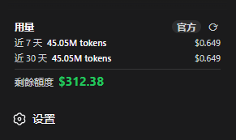

# dsh-usage-card

在 DeepSeek Harness 側欄的「設置」上方，放一張用量卡片：最近花了多少 token、多少錢、還剩多少額度。



- **近 7 天 / 近 30 天**：token 用量與消費
- **剩餘額度**：沿用你在設置裡填的 DeepSeek API Key
- **官方或估算**：有平台登入 token 就跟 [DeepSeek 用量頁](https://platform.deepseek.com) 對齊；沒有就用本機對話紀錄估算
- 側欄收合時變成小圖示，點一下仍可設定

## 安裝

適用 DeepSeek Harness **Web 介面**（0.1.x）。裝完後重啟 `dsh web`，再刷新瀏覽器。

```sh
dsh plugin --profile web add github:kazma258/dsh-usage-card
```

本機開發目錄改用 `dsh plugin --profile web add ./`。若之後發布到 npm，則用 `dsh plugin --profile web add dsh-usage-card`。

卸載：

```sh
dsh plugin --profile web remove dsh-usage-card
```

## 改看官方數據

卡片預設是「估算」。點右上角的 **估算 / 官方 / 無數據**，貼上平台 `userToken`（**不是** API Key）。過期後會自動退回估算。

取得方式：登入 [platform.deepseek.com](https://platform.deepseek.com) → 瀏覽器開發者工具 → Console：

```js
JSON.parse(localStorage.getItem('userToken')).value
```

## 進階設定

可在 profile 的 `cordis.patch.yml` 覆寫單價與幣種（整行替換，不會只改其中一個欄位）：

```yaml
- id: usage-card
  name: dsh-usage-card
  config:
    estimatePrices:
      inputUncached: 0.28
      cacheRead: 0.07
      cacheWrite: 0.28
      output: 1.1
    estimateCurrency: USD
    officialCurrency: USD
```

其他可調項：`path`、`tokenPath`、`balanceCredential`、`balanceUrl`、`balanceTtlMs`、`platformTokenCredential`、`platformBaseUrl`、`usageTtlMs`、`timeoutMs`、`invalidateOnTurnEnd`。

卡片會在對話結束、切回分頁、每 60 秒，以及按刷新時更新。暫時不想用這張卡時，從該 profile 的 bundle 列表拿掉 `dsh-usage-card` 再重啟即可。

## 開發

```sh
node --check lib/index.js lib/client.js lib/aggregate.js
node test/aggregate.test.mjs
```

建議鎖定 commit 安裝：`github:kazma258/dsh-usage-card#<40-character-sha>`。驗證是否掛上可跑 `dsh --profile web --dump-config`。

## License

MIT
